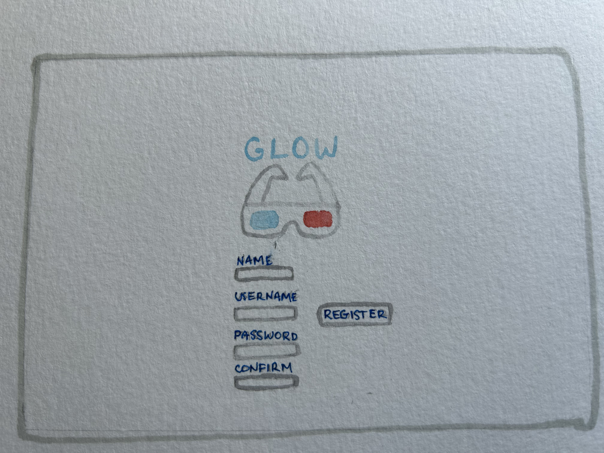
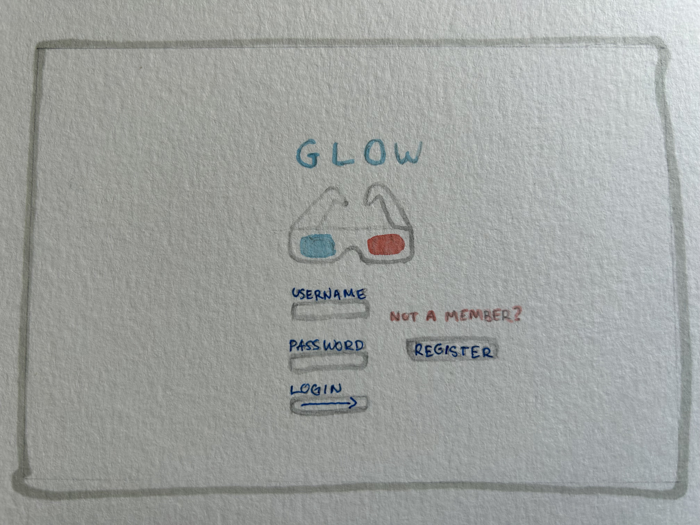
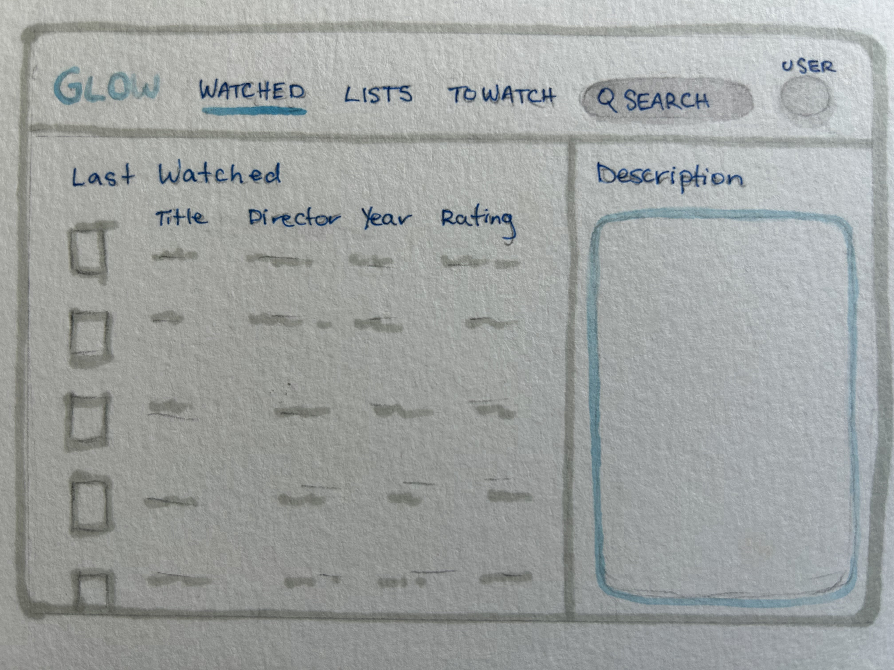
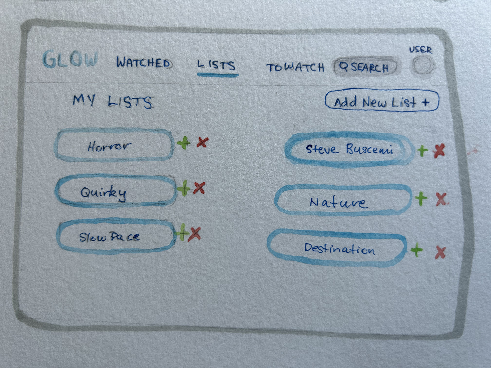
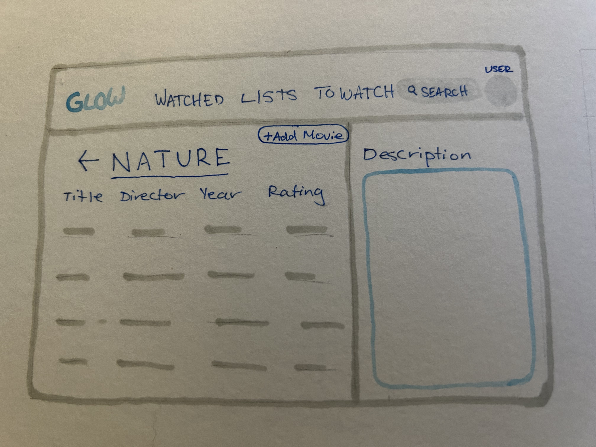
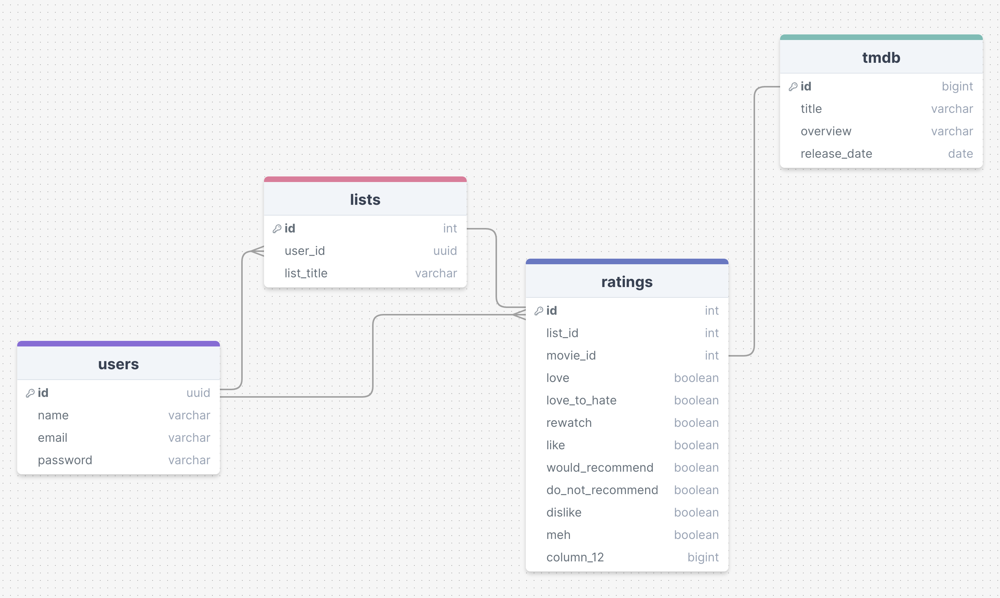

# Project Title
Glow

## Overview
Glow is a way for movie enthusiast and cinephiles alike to keep tack of what they have watched.

A simple and uncluttered movie tracking application for easy return watching. You can track what you're watching in a list for your own personal use. Create different lists, rate and find what to watch next based on your own personal library.

### Problem
With a nostalgic feel, you can easily find and return to your favourite, comfort watches. Without being inundated with countless new options, choosing what to watch becomes easier and faster.

### User Profile
- Movie enthusiasts:
    - looking to unwind after a long day
    - looking to make menial tasks enjoyable
    - inexpensive weekend activity
    - those that want to keep track of the movies they watch

### Features

Prospective users will need to create an account and login to their new account.

All users need to be logged in:
    - As a user, I want to be able to find a movie, and add or remove it from a list
    - As a user, I'd like to rate what I add to a list
    - As a user, I want to be able to create, see, and manage multiple lists
    - As a user, I want to be able to filter through my lists to find what to watch
    - As a user, I'd like to upload a to watch movie list

## Implementation

### Tech Stack

- React
- JavaScript
- MySql
- Express
- Client Libraries
    - react
    - react-router
    - axios
- Server Libraries
    - knex
    - express
    - bcrypt for password hashing

### APIs

List any external sources of data that will be used in your app.
- [The Movie Database](https://www.themoviedb.org/)

### Sitemap
- Register: where a user can create an account
- Login: where an existing user that has already signed up can login
- Homepage/user dashboard: display the users account with an unedited display of all the movies marked as watched with the most recently watched movie's description showing on the right. List displays most recently added at the top.
- Lists: where users can create lists to track the movies they've watched or want to watch. Add new list or delete: modal on Lists page with one input, the title.
- Single List: A selected List displays a list of the users choice. A list a user can add to from either their own lists or TMDB

List the pages of your app with brief descriptions. You can show this visually, or write it out.
#### Register

#### Login 

#### Homepage/user dashboard: 

#### Lists

#### Single List

### Mockups

Provide visuals of your app's screens. You can use tools like Figma or pictures of hand-drawn sketches.

### Data

1:N - Each user can create multiple movie lists but each movie list that has been created by only one user

N:N - a user can have many movies in their list, and each movie can be in multiple users' lists

### Endpoints

**POST /users/register**
- Add a user account

Parameters:
- name
- email: user's email
- password: user's provided password

**POST /users/login**
- Login a user

Parameters: 
- email: user's email
- password: user's provided password

#### GET
- Get a searched movie from TMDB public api using a search 
- url: 'https://api.themoviedb.org/3/search/movie',
- parameters:"my search term"

Return: providing a query string will provide the closest match the the provided string

#### POST
- post/create a new list to your current list of list
- post a movie to a list from TMDB

#### PUT
- update a rating for a movie in a list

#### DELETE
- delete a whole list
- delete a movie from a list

### Auth

The application will need a login to retrieve your stored data giving you a personalized dashboard
- JWT auth
    - Store JWT in localStorage, remove when a use logs out
    - Add states for logged in showing different UI as shown in mockups

## Roadmap

Scope your project as a sprint. Break down the tasks that will need to be completed and map out timeframes for implementation. Think about what you can reasonably complete before the due date. The more detail you provide, the easier it will be to build.

- Create client
    - react project with routes and boilerplate pages

- Create server
    - express project with routing

- Create migrations
    - create seed data for a user with existing lists

- Feature: Single List page, a selected movie list
    - display list of movies
    - add modal for adding a movie, updating the rating, and deleting a movie from the list
    - Create GET, POST, PUT, DELETE /user/lists/:id

- Feature: Lists page
    - display a number of lists created by the user
    - add modal for adding a list, updating the list, and deleting a list
    - Create GET, POST, PUT, DELETE /user/lists

- Feature: User Dashboard
    - Get information from lists to display on user dash

- Feature: Create account
    - Implement register page and form
    - Create POST /users/register endpoint

- Feature: Login
    - Implement login page and form
    - Create POST /users/login endpoint

- Feature: Implement JWT tokens
    - Server: Update expected requests / responses on protected endpoints
    - Client: Store JWT in local storage, include JWT on axios calls

- Bug fixes

## Nice-to-haves

- Allowing the user to filter for movies using their own ratings
- An advanced search feature
- Ability for user to customize their dashboard, to choose what list they want to see first upon login rather than last watched
- Forgot password functionality
- Ability to see where you can stream said movie on list
- Ability to display movies based on chosen streaming service
- Ability to add other users from your contacts and share what your watching. Incorporate in app messaging
- After logging in, the user can choose between TV and Movies

